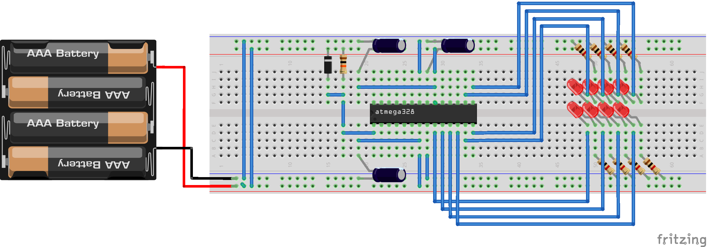
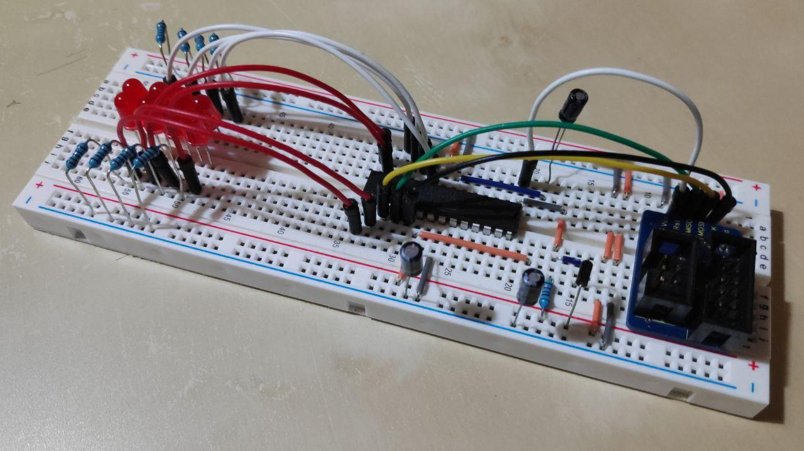
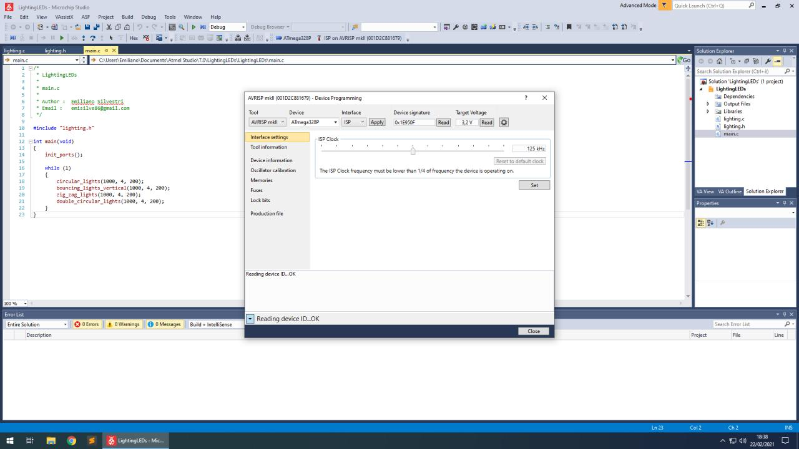
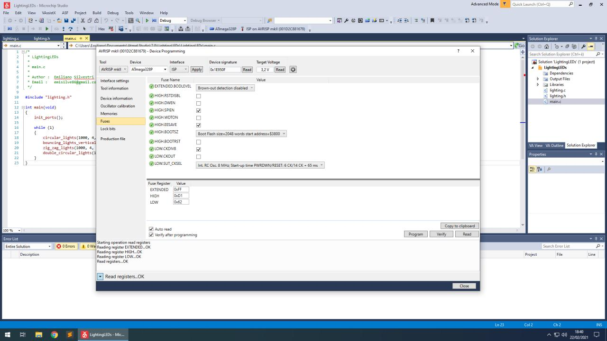
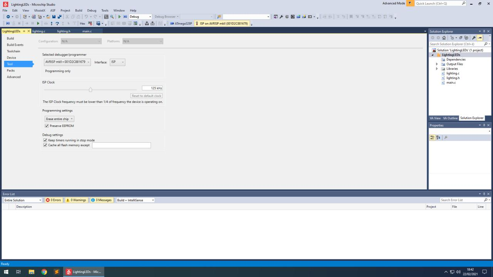
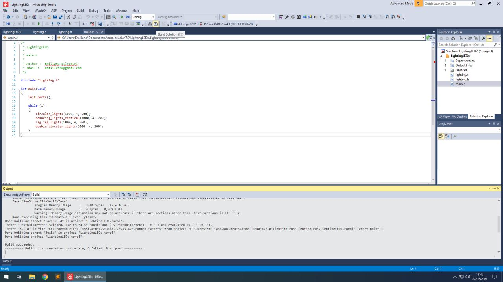
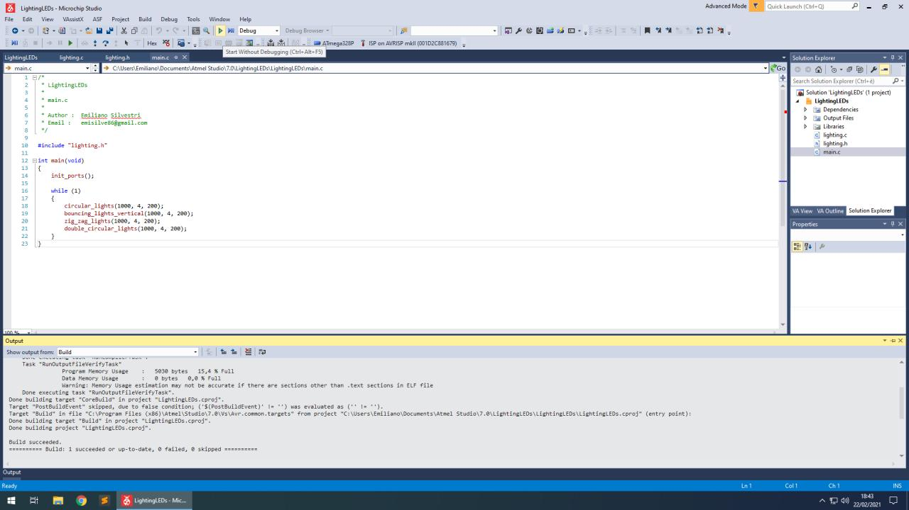

# 4x2 Lighting LEDs Matrix with ATmega328P

This repository is intended to provide novice FW programmers with a guide for making hardware setup on a breadboard with Atmel ATmega328P-pu. Altough it introduces notions about electronic configurations which are typical of digital circuitry, it is a very simple guide that is the result of half a day's work with the ATmega328P microcontroller. Also the code provided and presented in this guide is very simple and allows to light a 4x2 matrix of LEDs with different patterns and frequencies.

## Introduction

ATmega328P is a 28 pin high performance, low power 8-bit microcontroller based on AVR RISC architecture. It is the most popular of all AVR controllers as it is used in ARDUINO boards. By
executing powerful instructions in a single clock cycle, the ATmega328P allows the system designer to optimize power consumption versus processing speed. Altough we will focus on a few of the follwing features, the ATmega328P provides:

* 32K bytes of in-system programmable flash with read-while-write capabilities;
* 1K bytes EEPROM;
* 2K bytes SRAM;
* 23 general purpose I/O lines;
* 32 general purpose working registers;
* three flexible Timer/Counters with compare modes;
* internal and external interrupts;
* a serial programmable USART;
* a byte-oriented 2-wire serial interface;
* an SPI serial port;
* a 6-channel 10-bit ADC (8 channels in TQFP and QFN/MLF packages);
* a programmable watchdog timer with internal oscillator;
* five software selectable power saving modes.

By the way, we will have to deal with I/O ports and their pins in order to drive 8 different LEDs arranged in a 4x2 matrix. All ports have true read-modify-write functionality when used as general digital I/O ports. This means that the direction of one port pin can be changed without unintentionally changing the direction of any other pin. The same applies when changing drive value (if configured as output) or enabling/disabling of pull-up resistors (if configured as input). In the figure below is reported the pinout configuration of ATmega328P-pu.

## Components

What follows is a list of all the componenets required in order to complete the hardware setup:

* 1x **AVRISP mkII** programmer for flashing programs with no need of any pre-installed bootloader;
* 1x **breadboard** for solderless hardware configurations;
* 1x **ATmega328P-pu** without bootloader;
* 1x **ISP socket** with 10-pins (or a 6-pin header with the adapter for AVRISP mkII);
* 3x **100 nF capacitor**;
* 1x **ESD protection diode**;
* 1x **10 k&#937; resistor**;
* 8x **LED**;
* 8x **1 k&#937; resistor**;

Several jumper wires and cables with different length.

## Hardware Design

In the figure shown below we report how all the components have been connected on the breadboard by also taking care of the considerations provided by Atmel for a correct completion of the hardware configuration. This mainly involves the configuration of RESET and (A)VCC pins.

The RESET pin on the AVR device is active-low, and setting the pin low externally will reset the device. Connecting the RESET so that it is possible to enter both high-voltage programming and ordinary low-level Reset can be achieved by using a pull-up resistor to the Reset line. This pull-up resistor avoids any unintended low signal that will trigger a Reset. Since the AVR device must be programmed using an external programmer, the pull-up must not be in such a high state that the programmer is not able to activate Reset by drawing the RESET line low. The recommended pull-up resistor value is 4.7 k&#937; or larger. In this regard, we have chosen a 10 k&#937; to be also compatible with DebugWIRE protocol whether engaged. We want to point out that AVR devices already have internally a low-pass filter to eliminate spikes and noise that could cause Reset, thus it is not directly required to add a capacitor between the RESET pin and ground plane as it would only be an additional protection when working in noisy environments. On the contrary, ESD (Electrostatic Discharge) protection diode is not provided internally from Reset to VCC in order to allow HVPP (High Voltage Parallel Programming). Since we never use such a feature, we have add an ESD protection diode externally from Reset to VCC. No external switch Reset has then been placed on the Breadboard and we remand the interested reader to the official documentation for this additional configuration.

Most AVR microcontrollers operate over a wide voltage range and draw only a few mA of supply current. This may give the impression that the power supply is not critical but the supply
current is an average value. By the way, the current is drawn in very short spikes on the clock edges. If I/O lines are switching, the spikes will be even higher. So, in order to avoid that the power and ground planes will spread a lot of noise the main source should be the decoupling capacitor. This is why it is recommended not to place the capacitor too far away from the microcontroller, thus creating a larger high-current loop. For the purposes of our work, even considering the low voltage applied at the VCC pin and the non-noisy environment where the microcontroller is intended to be used, we didn't follow this reccommandation at the best and used only a 100 nF capacitor to configure the decoupling as shown in the figure.

Even if we don't use the built-in ADC provided by the ATmega328P, a similar decoupling configuration has been put in place in front of the AVCC pin for future projects by still relying on a 100 nF capacitor between the power and ground planes. Similarly, the AREF pin must also be decoupled.

For what concerns LEDs, we place them in series with resistors sufficiently large to save power and reduce brightness. More in detail, these LEDs are characterized by a forward voltage of 1.8 V and a maximum current of 20 mA. Hence, in order to have a desired current of around 2 mA we have to use a resistor that matches the value (3,2 V - 1,8 V) / 0.002 A = 700 &#937; that we rounded up to 1 k&#937;. All of these have been then connected with the ATmega328P to the pins 9, 10, 11, 12, 13, 14, 15 and 16 in order to programmatically drive each one of them separately, which correspond respectively to the pins PB6, PB7, PD5, PD6, PD7, PB0, PB1 and PB2 belonging to the I/O ports B and D.

In the figure below is reported our implementation of the hardware configuration on breadboard which is compliant with the schema shown in the figure above. It is possible to notice the presence of a ISP socket that is used to connect the AVRISP mkII programmer with the ATmega. More in detail, the socket's pins MOSI, MISO, SCK and Reset have been connected through cables respectively to the pins 17, 18, 19 and 1 of the microcontroller. Additionally, the programmer has to supply power to the microcontroller during the programming phase, hence it is required to have the VCC and GND pins connected to the power and ground planes as well.

## Programming

The source code shared in this repository is a GCC C-project created with Microchip Studio for AVR which is an Integrated Development Platform (IDP) for developing and debugging AVR microcontroller applications. It merges all of the great features and functionality of Atmel Studio into Microchip’s well-supported portfolio of development tools to give you a seamless and easy-to-use environment for writing, building and debugging your applications written in C/C++ or assembly code. Its installer can be found and freely downloaded at this [link](https://www.microchip.com/en-us/development-tools-tools-and-software/microchip-studio-for-avr-and-sam-devices).

Once installed, this project can be easily imported with *File->Open->Project* and by selecting the solution file that is present within the repository. Also, you can check if your programmer has been correctly recognized and if it is correctly detecting the microcontrtoller by opening the *Device Programming* window and by requiring the read of the Device Signature. The latter operation is shown in figure below.

Into the same window, we can also find information about current values of *Fuses* which, in our case, indicate that we are using the 8 MHz internal oscillator which in turn is divided by 8 by the prescaler to produce a working frequency of 1 MHz.

At this point, we have only to check whether the correct prorammer has been selected for flashing program into memory of the microcontroller as shown below. Different values for the *ISP clock* can be chosen to set the frequency used to program the ATmega328P, but it strongly reccommended to not select a clock that overcomes 1/4 of its working frequency. Hence, 125 KHz (which is also the default) is a viable choice.

We are raedy to build the solution/project using the specific button provided in the toolbar.

We can then program the ATmega by starting the executable as shown below.

That' it. Below you can find a demo of our project where a 4x2 matrix of LEDs gets lighting with different patterns.

